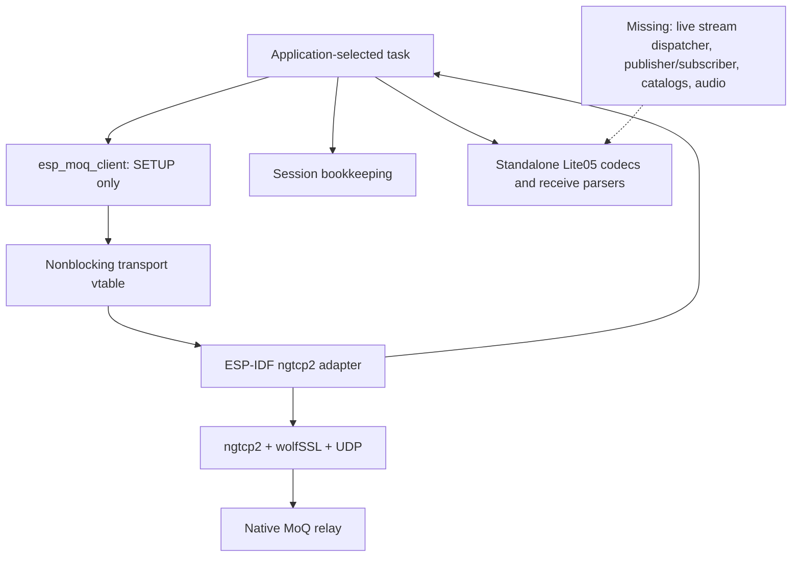

# moq-esp32 technical review

Reviewed 2026-08-30 against merged `main`, commit `f827391b839ef60d4d197bf0bc5fa135a0fa594e`.

## Assessment

**This revision is an early protocol and transport implementation, not yet a usable replacement for VoiceWatch's WebRTC audio path.** Its portable C code provides useful, bounded wire codecs, incremental readers, SETUP negotiation, and subscription bookkeeping. Its ESP-IDF adapter is a substantial implementation, but the active handshake build fails to link and transport lifecycle defects prevent sustained bidirectional media. Catalogs, integrated publication/subscription, audio, hardware support, and server peers remain unimplemented.

The independent backend/build and VoiceWatch integration review is [moq-integration-readiness.md](/Users/nickchadwick/Documents/voicewatch/docs/moq-integration-readiness.md). That report contains the reproduced backend failures, configured firmware build evidence, existing VoiceWatch responsibilities, and integration gates. This report describes the library architecture in detail and adds a portable-core audit.

The initial inspection found the pre-merge scaffold on `main` and implementation on a remote branch. The user then merged that branch. This final assessment uses the merged checkout; its content matches implementation commit `5409f86`. The old scaffold-only finding is superseded. No library source was changed and no hardware was flashed in this review.

## Repository and implemented scope

| Location under `libs/moq-esp32/` | Actual contents and responsibility |
| --- | --- |
| `compatibility/moq-dev.lock.json` | Pinned reference revision and intended protocol/media profile |
| `components/esp_moq/include/esp_moq/` | Public C types and functions for codecs, Lite05 messages, receive parsers, session state, client, and transport abstraction |
| `components/esp_moq/src/` | Nine portable C translation units, independent of ESP-IDF, TLS, board peripherals, and Opus |
| `components/esp_moq_transport_ngtcp2/` | ESP-IDF component containing UDP/socket/event-loop glue, ngtcp2 integration, wolfSSL setup, and bounded retained TX buffers |
| `third_party/ngtcp2` | Pinned upstream Git submodule |
| `examples/esp32s3_smoke/` | ESP32-S3 build/smoke example; not a media application |
| `examples/esp32s3_relay_handshake/` | Wi-Fi plus configured authenticated QUIC/SETUP experiment; stops after negotiation |
| `tests/host/test_wire.c` | Portable unit tests with deterministic vectors, roundtrips, mock transport, receive fragmentation, and object-size assertions |
| `.github/workflows/` | Host GCC/Clang checks and ESP-IDF 5.5.5 example builds |
| `components/esp_moq_audio/`, `boards/twatch_ultra/`, `examples/twatch_ultra_voice/` | README placeholders; no working audio component, Ultra BSP, or watch voice example |
| `tools/moq_reference_oracle/`, `server/` | README descriptions only; no Rust oracle, fixtures generator, echo program, or voice-agent implementation |

The root README is stale after the merge: line 24 says no production protocol code exists, while line 20 describes concurrent publication/subscription as a supported property. The implementation has progressed beyond the first statement but does not fulfill the second. The proposed high-level API in `docs/implementation-plan.md:279` is a design sketch, not callable code.

## Architecture and ownership

The architecture separates encoded media from networking and hardware. This is appropriate for reuse in VoiceWatch: the application should eventually supply encoded timestamped packets and receive complete media events without knowing QUIC stream IDs. The current public interfaces remain below that intended abstraction.



### Portable wire primitives

`codec.c` implements QUIC variable-length integers, ZigZag signed integer mapping, bounded readers/writers, length-prefixed byte slices, and UTF-8 validation. Varints are limited to 62 bits. Decoder acceptance of nonminimal QUIC-varint encodings is intentional and tested. UTF-8 checks reject overlong sequences, surrogate values, and truncated encodings.

The basic slice type is a borrowed pointer plus length. Decoding a string or payload generally does not allocate or copy it. The caller must preserve the original input for as long as the decoded slice is used. That requirement matters when moving data from a transient UDP/QUIC callback into another task.

Source: [codec.h](/Users/nickchadwick/Documents/voicewatch/libs/moq-esp32/components/esp_moq/include/esp_moq/codec.h:13), [codec.c](/Users/nickchadwick/Documents/voicewatch/libs/moq-esp32/components/esp_moq/src/codec.c:1).

### Lite05 message codecs

`lite05.c` provides SETUP, immutable track information, group prefixes, and frame headers. `lite05_control.c` adds control-stream types, announcement requests/results/broadcast updates, track requests, subscription requests, and START/END/DROP responses.

SETUP is a sized parameter message. The implementation bounds parameter count, rejects duplicates, skips unknown parameters, validates string lengths/UTF-8, and implements the reference's forward-compatible role/probe decoding. An unknown role becomes bidirectional; a higher unknown probe capability saturates to the highest recognized level. These behaviors match the pinned reference rather than representing missing validation.

Paths are canonical bounded UTF-8 strings: no leading/trailing slash or empty slash-separated segment, with at most 32 parts. The empty path is allowed. This broadcast-path validation is deliberately different from the native connection SETUP path, which may contain a leading slash and query string.

Group prefixes contain data type, sized header, subscription ID, and group sequence. Frame headers contain a signed delta from the preceding timestamp and payload length. The timestamp history advances only after a successful complete header operation; underflow/overflow and payload limits are checked. The outer timestamps use the track's timescale. They are not automatically microseconds merely because the inner Hang legacy timestamp is.

The headers enumerate FETCH, PROBE, and GOAWAY, but there is no complete operational handling for those streams. SUBSCRIBE_UPDATE also has no codec or runtime implementation. A type enum is not feature support.

Sources: [lite05.h](/Users/nickchadwick/Documents/voicewatch/libs/moq-esp32/components/esp_moq/include/esp_moq/lite05.h:13), [lite05.c](/Users/nickchadwick/Documents/voicewatch/libs/moq-esp32/components/esp_moq/src/lite05.c:114), [lite05_control.c](/Users/nickchadwick/Documents/voicewatch/libs/moq-esp32/components/esp_moq/src/lite05_control.c:100).

### Incremental receive parsers

`receive.c` has three independently allocated parser types:

- TRACK receiver: one immutable track-info message, then FIN; rejects subsequent bytes.
- SUBSCRIBE receiver: a sequence of typed START/END/DROP messages, decoded and emitted individually.
- GROUP receiver: group header, zero or more frames, and FIN; emits group/frame start, payload chunks, and completion callbacks.

The GROUP reader processes payload incrementally without buffering the whole media frame. It supports an empty group structurally: group prefix followed by FIN calls group start/end with no frames. However, it does not assign that event a Hang discontinuity meaning, assemble Opus packets, detect stale groups, reorder concurrent streams, or schedule playback.

Callbacks are synchronous. Control callback structures are stack locals, and frame data points into the caller's input. Consumers must copy any data retained after the callback. Returning an error, including WOULD_BLOCK, marks the reader failed; there is no resumable media-backpressure contract. An integration must use a bounded owned queue or decide to drop/reset the stream, rather than perform blocking audio/UI work from the parser callback.

There is no stream-ID-to-parser registry. The application currently has to decide which reader receives each stream, allocate bounded parser slots, reject mismatched IDs, reclaim them after reset/FIN, and associate received groups with live subscriptions. These are library responsibilities still to implement, not operations supplied by the current client.

Sources: [receive.h](/Users/nickchadwick/Documents/voicewatch/libs/moq-esp32/components/esp_moq/include/esp_moq/receive.h:14), [receive.c](/Users/nickchadwick/Documents/voicewatch/libs/moq-esp32/components/esp_moq/src/receive.c:26).

### Session bookkeeping

The session state moves through IDLE, CONNECTING, NEGOTIATING, READY, CLOSING, CLOSED, or FAILED. READY requires both local SETUP submission and peer SETUP receipt. A `voice_active` flag records application intent but does not start capture or network publication.

The subscription table has four entries. IDs increase monotonically within a connection and are not reused after freeing a slot. START records the absolute start group; END records an exclusive end group and marks the subscription ended; DROP records only the most recent dropped range. The table detects duplicate starts, reversed DROP ranges, responses for unknown IDs, and invalid lifecycle transitions.

It does not send requests, retain full requested track identities, own receive streams, provide completion callbacks, drain already in-flight groups, or apply group ranges to playback. END does not by itself prove that all earlier media has arrived or played. Transport closure must be forwarded by the caller; reconnect/backoff and reannouncement/resubscription do not exist.

Source: [session.h](/Users/nickchadwick/Documents/voicewatch/libs/moq-esp32/components/esp_moq/include/esp_moq/session.h:15), [session.c](/Users/nickchadwick/Documents/voicewatch/libs/moq-esp32/components/esp_moq/src/session.c:30).

### Client API: useful negotiation driver, not a media client

The callable client API is `init`, `start`, `transport_connected`, `flush`, `peer_setup_feed`, and `peer_setup`. Its sole queued TX operation is SETUP. Initialization encodes and copies SETUP bytes, so its immediate transmission does not depend on the original path buffer remaining unchanged. The stored `local_setup` itself is a shallow structure copy and is not a general owned configuration object.

The flush loop handles stream-credit blocking, partial accepted writes, zero-progress writes, and a blocked FIN. Peer SETUP is accumulated in a fixed buffer until FIN, then parsed and checked for extra bytes. This is a reasonable small driver to exercise the backend.

It does not yet expose `publish_audio`, `subscribe_audio`, `write_opus`, or `discontinuity`. Those names exist only in the plan. There is also no client close/reconnect/update-credentials API. A caller can manipulate lower-level session and vtable objects, but doing so does not create an integrated lifecycle.

The handshake example sends a bidirectional-role SETUP, routes incoming data only to the SETUP reader, logs success when READY, and closes immediately. It cannot publish or receive a catalog or audio group, and it is not an end-to-end interoperability test.

Sources: [client.h](/Users/nickchadwick/Documents/voicewatch/libs/moq-esp32/components/esp_moq/include/esp_moq/client.h:18), [client.c](/Users/nickchadwick/Documents/voicewatch/libs/moq-esp32/components/esp_moq/src/client.c:39), [handshake example](/Users/nickchadwick/Documents/voicewatch/libs/moq-esp32/examples/esp32s3_relay_handshake/main/main.c:100).

## Protocol compatibility and Hang semantics

The lock targets `moq-dev/moq` commit `eb5776e21eeaecba8e844be53c821895c178bcaf`, ALPN `moq-lite-05`, Hang legacy framing, Opus, and both `catalog.json` and `catalog.json.z`. This is a specific deployed ecosystem profile, not a claim to implement every IETF MoQ draft. The transport uses native QUIC rather than HTTP/3 WebTransport; the authentication path/query travels in SETUP.

Selective inspection against the pinned Rust sources found the intended SETUP parameter meanings, sized-message rules, START/END/DROP tags, subscription field order, and Hang timestamp framing consistent. This is a source comparison, not a byte-for-byte conformance certification. Sources: [pinned SETUP](https://github.com/moq-dev/moq/blob/eb5776e21eeaecba8e844be53c821895c178bcaf/rs/moq-net/src/lite/setup.rs), [pinned subscription messages](https://github.com/moq-dev/moq/blob/eb5776e21eeaecba8e844be53c821895c178bcaf/rs/moq-net/src/lite/subscribe.rs), [pinned sized-message implementation](https://github.com/moq-dev/moq/blob/eb5776e21eeaecba8e844be53c821895c178bcaf/rs/moq-net/src/lite/message.rs).

`hang.c` implements only `varint(timestamp_us) + payload`. It can encode/decode arbitrary bytes, including an empty payload; it does not inspect Opus validity, codec configuration, channel count, sample rate, pre-skip, or terminal padding. Source: [hang.c](/Users/nickchadwick/Documents/voicewatch/libs/moq-esp32/components/esp_moq/src/hang.c:5).

The pinned Hang reference uses microseconds for legacy frames and chooses a matching microsecond track timescale. Its audio producer cuts each normal audio packet into its own group. A discontinuity is a distinct empty-group boundary that resets codec/timeline state; a normal audio-group FIN is not an end-of-utterance marker. Terminal flush can also publish an empty-payload timestamp frame followed by tail packets, so a receiver must not blindly submit every Hang payload to the Opus decoder. These distinctions need generated fixtures and explicit integration behavior. Sources: [pinned Hang frame](https://github.com/moq-dev/moq/blob/eb5776e21eeaecba8e844be53c821895c178bcaf/rs/hang/src/container/frame.rs), [pinned audio producer](https://github.com/moq-dev/moq/blob/eb5776e21eeaecba8e844be53c821895c178bcaf/rs/moq-audio/src/encode/producer.rs).

There is no catalog generation/parser, compressed-catalog inflater, live catalog update logic, or audio rendition selection. The JSON example in the implementation plan is illustrative. Interoperability requires confirming the actual serialization, compressed catalog framing, media metadata, timestamps, empty groups, and terminal packets against the pinned upstream implementation.

## Additional portable-core defects

### C1 — Rejected duplicate start destroys an active negotiation

**Reproduced; affects lifecycle robustness.** `esp_moq_client_start` clears TX state and peer SETUP state before `esp_moq_lite05_session_start` validates that the session is IDLE or CLOSED. If SETUP is queued behind WOULD_BLOCK, a duplicate start returns INVALID_STATE but has already set `tx.active=false`. Subsequent flush returns OK without sending the required SETUP. The state remains NEGOTIATING with `local_setup_sent=false`.

A rejected operation should not corrupt an existing operation. Validate the session transition before clearing client state, or make start deliberately idempotent with a documented result. Add coverage for duplicate calls in CONNECTING, NEGOTIATING with partial writes/blocked FIN, and READY.

Sources: [client.c:60](/Users/nickchadwick/Documents/voicewatch/libs/moq-esp32/components/esp_moq/src/client.c:60), [session.c:30](/Users/nickchadwick/Documents/voicewatch/libs/moq-esp32/components/esp_moq/src/session.c:30).

### C2 — Optional group boundary overflow silently removes the boundary

**Reproduced; invalid-input correctness issue.** `option_size` and `write_option` reject `value == ESP_MOQ_VARINT_MAX`, but not all larger values. A present boundary equal to `UINT64_MAX` wraps when incremented to represent `Some(value)`. The wrapped zero is valid on the wire and means absent. A request with `has_start_group=true` and `start_group=UINT64_MAX` therefore encodes successfully and decodes as no start boundary. The same helper serves the end boundary.

Reject every present value greater than or equal to `ESP_MOQ_VARINT_MAX` before adding one. This is a public-API input issue, not a demonstrated remote code-execution vulnerability.

Source: [lite05_control.c:462](/Users/nickchadwick/Documents/voicewatch/libs/moq-esp32/components/esp_moq/src/lite05_control.c:462).

### Other lifecycle contracts that must be completed

Peer SETUP parse failures return errors without consistently moving the client into FAILED or closing transport; the application must do that today. Incoming stream direction/initiator validation is also external. Control-stream FIN is recorded by the parser but does not drive subscription completion in the session table. A complete client should centralize those transitions and make failed/cancelled operations unable to revive stale playback.

These are missing integration contracts, not evidence that every malformed packet is accepted. The existing bounded parsers reject many malformed inputs correctly; the absent dispatcher and operation lifecycle determine what happens after rejection.

## QUIC backend, security, and build

The optional backend uses ngtcp2 v1.25.0 and the managed wolfSSL 5.8.2~1 component. ESP-IDF 5.5.5 is the CI target. A native QUIC connection runs on a nonblocking UDP socket; `poll` processes receive packets, expiry, outgoing packets, and a deferred connection callback. The application-selected networking task owns the adapter.

The adapter retains accepted stream bytes in 64 blocks of 256 bytes until acknowledged or stream closure. It tracks 16 TX streams, one pending 1,350-byte datagram, and a 4,352-byte deferred initial receive buffer. It extends consumed byte-flow-control windows. The fixed send pool is a sound foundation for retransmission buffer lifetime, but it does not cap ngtcp2/wolfSSL allocations or inbound reassembly memory.

TLS setup requires supplied PEM trust roots, selects TLS 1.3, enables peer-chain verification, sends SNI, checks the relay hostname, and verifies selected ALPN. These are implemented positive properties. No backend TLS-negative tests or live certificate verification results are present. The example uses one bundled root and does not establish wall time before TLS. Device provisioning, scoped JWT issuance, renewal, expiry handling, and credentials redaction policy beyond this example are not implemented.

The companion review reproduced a configured ESP-IDF linker failure: enabling the real code path with nonempty dummy credentials exposes missing wolfSSL session-cache symbols. Default empty-JWT CI can succeed because the compiler removes the unreachable handshake path. It also reproduced rejection of replies on peer bidirectional streams and starvation of newer streams behind a blocked stream. Source inspection found missing stream-credit renewal, an advertised receive-datagram limit larger than the receive buffer, and unsafe callback-to-write reentrancy. Those are blockers for the intended 50-group-per-second media profile; see the evidence and correction gates in the [readiness report](/Users/nickchadwick/Documents/voicewatch/docs/moq-integration-readiness.md).

Source entry points: [backend config/API](/Users/nickchadwick/Documents/voicewatch/libs/moq-esp32/components/esp_moq_transport_ngtcp2/include/esp_moq/ngtcp2_transport.h:1), [TLS initialization](/Users/nickchadwick/Documents/voicewatch/libs/moq-esp32/components/esp_moq_transport_ngtcp2/src/esp_moq_ngtcp2.c:835), [backend build configuration](/Users/nickchadwick/Documents/voicewatch/libs/moq-esp32/components/esp_moq_transport_ngtcp2/CMakeLists.txt:1).

## Audio, Ultra hardware, and server readiness

The proposed optional audio profile is mono signed 16-bit PCM at 16 kHz, 20 ms/320-sample frames, Opus VOIP around 20 kbps, constrained VBR, DTX, adaptive FEC, and a 60–80 ms jitter target. Those are design targets. No Opus encoder/decoder, jitter buffer, PLC/FEC policy, sample-clock mapping, microphone capture, or speaker playback implementation exists in the library.

The first product policy is half-duplex push-to-talk to avoid requiring acoustic echo cancellation while retaining simultaneous network publish/subscribe capability. The policy still needs explicit capture/playback arbitration, interruption semantics, response drain/completion, and stale-generation rejection. MoQ does not replace those behaviors automatically.

The Ultra board README names the T3902 microphone, MAX98357A amplifier, PTT control, and LilyGoLib as hardware authority, but supplies no source. The two ESP32-S3 experiments are not Ultra BSPs. The parent review found their octal-PSRAM defaults incompatible with the Ultra's documented quad-PSRAM configuration and identified the existing VoiceWatch production BSP as the older S3 watch. A full Ultra shell requires a separate verified panel/touch/power/audio target before media integration.

The planned server design is reasonable: a reference peer subscribes to the watch's Hang broadcast, decodes PCM for ASR/agent processing, and publishes a second Hang broadcast for TTS; the relay remains media-agnostic. Neither the echo peer nor AI adapter exists here. VoiceWatch's current server must gain a MoQ endpoint while preserving conversation identity, cancellation, response pacing, and control/app-delivery semantics.

Sources: [audio placeholder](/Users/nickchadwick/Documents/voicewatch/libs/moq-esp32/components/esp_moq_audio/README.md:1), [Ultra placeholder](/Users/nickchadwick/Documents/voicewatch/libs/moq-esp32/boards/twatch_ultra/README.md:1), [server placeholder](/Users/nickchadwick/Documents/voicewatch/libs/moq-esp32/server/README.md:1).

## Tests performed and strength of evidence

The portable source was archived into `/tmp/voicewatch-moq-review.hpqJBF` to run tests without editing the library checkout. The archive came from `5409f86`, whose tree was verified identical to merged `f827391`.

| Validation | Result and meaning |
| --- | --- |
| Strict host build and `make -C tests/host clean test` | PASS: 300,480 checks; repeated successfully |
| Focused C1/C2 harness linked against all portable source | Both failures reproduced; no source changes |
| Portable `make sanitize` | Compiled, then stalled on this host; terminated after approximately eight minutes; no sanitizer pass or detected defect claimed |
| Pinned Rust source comparison | Selected SETUP, subscription, sized-message, Hang frame, and audio producer semantics inspected |
| ESP-IDF builds | Parent reproduced active-path linker failure; default empty-JWT build succeeds only for a reduced path |
| Real relay/hardware/audio tests | Not performed; no device or media interoperability claim |

The 300,480 count is assertions, not distinct tests: 300,000 come from 100,000 deterministic varint encode/decode roundtrips. The remaining tests meaningfully cover boundary vectors, malformed UTF-8, duplicate/unknown SETUP parameters, control wire shapes, subscription bookkeeping, partial writes/blocked FIN, byte-fragmented receives, oversize/truncated groups, and object-size caps. They do not exercise ngtcp2, wolfSSL, UDP loss, concurrent stream dispatch, real codecs, catalogs, or a relay.

Measured host object sizes were client 8,744 bytes, TRACK receiver 4,144 bytes, SUBSCRIBE receiver 4,152 bytes, GROUP receiver 144 bytes, and session 336 bytes. These are host ABI sizes, not measured ESP32 heap usage. The client contains a session already; do not double-count it when estimating a containing object's size. Source: [size assertions](/Users/nickchadwick/Documents/voicewatch/libs/moq-esp32/tests/host/test_wire.c:972).

The test file contains static expected-byte arrays and same-implementation roundtrips. It does not invoke pinned Rust, include a fixture-provenance manifest, or replay captured sessions. The promised reference oracle is still a README. Thus the project has useful unit tests but has not satisfied its own independent conformance gate.

The parent independently reran both additional reproductions against the merged checkout and preserved [the harness](/Users/nickchadwick/Documents/voicewatch/docs/review-evidence/moq-esp32-f827391/core_review_repros.c) and [its output](/Users/nickchadwick/Documents/voicewatch/docs/review-evidence/moq-esp32-f827391/core-repros.txt). The original temporary harness was `/tmp/voicewatch-moq-review.hpqJBF/core_review_repro.c`. Its output was:

```text
REPRODUCED: rejected duplicate client_start discards queued SETUP, session remains NEGOTIATING
REPRODUCED: has_start_group=true, start_group=UINT64_MAX encodes successfully as absent
sizeof client=8744 track_rx=4144 subscribe_rx=4152 group_rx=144 session=336
```

## Readiness decision

Keep this library as the candidate transport implementation, but do not remove WebRTC or represent the current client as media-ready. The architecture and portable building blocks are reusable. The necessary next deliverables are a correctly linked authenticated transport, fixed stream lifecycle and scheduling, a complete bounded publisher/subscriber client, generated reference fixtures, catalog/audio semantics, and bidirectional reference-peer tests.

Only after those gates should VoiceWatch integrate the media adapter and measure the full Ultra shell. That integration must preserve the existing application control channel, conversation and owner identities, capture boundaries, response pacing, cancellation, app delivery, and hardware abstraction. A successful SETUP log, smoke image, or large unit-test assertion count cannot substitute for that evidence.
