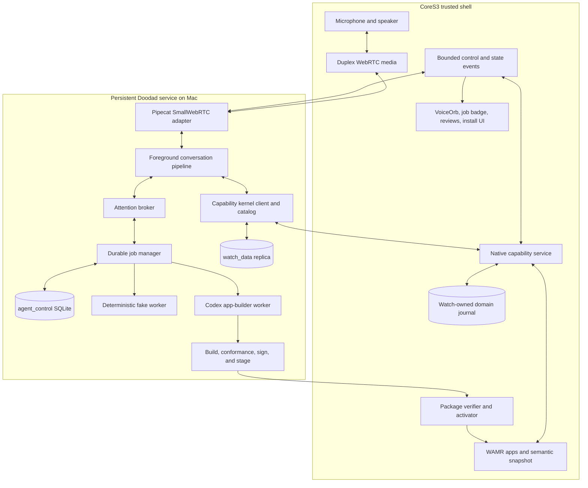

# Live foreground agent and durable jobs vertical-slice plan

| Field | Value |
|---|---|
| Status | Phases 0–4 implemented and verified on CoreS3 SE; Phases 5–8 proposed |
| Last updated | 2026-08-03 |
| First hardware target | M5Stack CoreS3 SE |
| Host | Apple Silicon Mac |
| Foreground runtime | Pipecat cascaded voice pipeline |
| Durable worker | Codex app-server behind a job manager |
| Final port in this sequence | T-Watch S3, only after the CoreS3 gate passes |

## 1. Outcome

Build one end-to-end demonstration in which Doodad remains a responsive voice
companion while it performs immediate watch actions and supervises independent,
durable background work.

The decisive demonstration is:

1. Start a persistent voice session from the CoreS3.
2. While the Workout app is foregrounded, say “I missed that set.”
3. Resolve “that set” from a current device snapshot, commit one idempotent
   typed mutation, update the watch, and answer in the same conversational
   turn.
4. Say “What is next?” and answer from a typed `current_workout` view.
5. Say “Log that I ate a bagel.” Commit a provisional typed food entry and
   confirm it without waiting for optional enrichment.
6. Say “Build me a rest-timer app.” Return a durable job ID immediately and
   continue the ordinary conversation.
7. A deterministic fake worker asks for a ring or bar layout after a delay.
   The attention broker waits for a natural pause, focuses that question, and
   associates “the ring” with the correct job.
8. The fake worker completes later. Progress remains visual; completion is
   spoken only at a policy-approved pause.
9. Restart the Mac service while the job or question is pending and prove that
   the job, focus token, and delivery state recover without duplicate speech.
10. Replace the fake worker with Codex app-server. Codex creates a simple
    Doodad rest-timer package, the existing build/check/test pipeline validates
    it, and the system offers a reviewed installation.

This slice is successful only if normal conversation remains available during
steps 6 through 10. Speech recognition by itself, a one-shot chatbot, or a
blocking “building” screen does not satisfy the outcome.

## Phase 0–4 implementation and verification record

Phases 0 through 4 are implemented in this repository and were exercised
end-to-end on the attached CoreS3 SE. The completed scope is the foreground
conversation plane, typed watch capabilities, durable fake-worker jobs, the
attention broker, recovery, and the orthogonal watch UI. Codex integration,
generated-package activation, the wider hardening/evaluation phase, and the
T-Watch port remain Phase 5 through Phase 8 work.

The implementation includes:

- a locked Pipecat service in [`services/live-agent`](../services/live-agent/)
  with SmallWebRTC transport, streaming STT, a text/tool model, ElevenLabs
  streaming TTS, local VAD/turn detection, bounded tracing, and provider-free
  test seams;
- versioned agent, watch-state, capability, job-event, and question contracts,
  with Workout, Calories, and Timer agent contracts;
- duplex PCMU media, a single-owner CoreS3 codec loop, bounded playback queues,
  watch-authoritative Workout and Calories journals, revision checks, and
  idempotent `record_missed_set`, `get_next_set`, and `log_food` operations;
- SQLite job/event/question/answer/delivery persistence, leases, deterministic
  fake-worker scheduling, restart recovery, focused answer routing, and
  at-most-once attention delivery; and
- separate foreground `VoicePhase` and background job state, allowing the
  VoiceOrb to listen while a build badge or focused question remains visible.

Verification completed on 2026-08-03:

- A single uninterrupted hardware soak ran for 626.552 seconds between the
  first and final inbound statistics samples. It ended at service monotonic
  time 632.828 seconds with 31,213 RTP audio packets received, zero reported
  packet loss, 25 capture commands, and repeated bounded capture-lease
  renewals. Five deliberately encountered missing-final STT watchdog paths all
  recovered without stopping the uplink. Two final foreground turns and two
  audible TTS responses completed during the same session, including a typed
  `get_next_set` call.
- Physical microphone-to-STT-to-tool-to-watch-to-TTS round trips committed a
  missed Workout set at authoritative revision 2 and a provisional food entry
  at revision 3. A device reboot restored revision 3, including both records.
- Three fake app-build jobs reached `completed`; all three layout questions
  were answered exactly once (`ring`, `bar`, `ring`). Foreground workout
  conversation continued during a job. One service was killed while a
  question was pending, then restored the same job and focus token from SQLite.
  Focused answers bypassed the LLM/tool path, and completion was spoken once at
  a later policy-approved pause.
- Repeated physical microphone/speaker/microphone cycles completed with zero
  dropped playback frames and no I2S ownership failures after moving all codec
  transitions onto one firmware task.
- `./scripts/test-live-agent.sh` passed 17 tests; the independent Echo Bridge
  protocol lane passed 3 tests; and `./scripts/test-all.sh` passed the full
  desktop, native, SDK, contract, conformance, WAMR, golden, and firmware
  suite, including 168 Python tests, 15 native tests, 9 SDK tests, 16 contract
  tests, and all 20 conformance packages.

The CoreS3 microphone and speaker share one codec/I2S controller, so this slice
uses the documented touch-to-interrupt fallback: touching the VoiceOrb stops
queued assistant audio and restarts capture. True simultaneous acoustic
barge-in is not claimed for this board configuration. The broader definition
of done in section 16 intentionally remains open until Phases 5 through 8 are
implemented.

## 2. Why this is the next slice

The repository already proves much of the embedded runtime and the first half
of the audio path. The missing product behavior is coordination across those
pieces.

### Existing foundation to preserve

- [`voice_service.cpp`](../firmware/main/src/voice_service.cpp) captures the
  CoreS3 microphone and sends PCMU audio through an Espressif WebRTC peer.
- The [Echo Bridge](../tools/voice-uplink/README.md) receives that track on the
  Mac, records it, transcribes it with `whisper.cpp`, and returns a bounded
  `transcript.final` event to the Voice Notes guest.
- [`voice-runtime.md`](voice-runtime.md) already locks the important trust
  boundary: audio, transport, Voice UI, permissions, and app lifecycle are
  host-owned services rather than guest-owned facilities.
- The native shell already has trusted Voice, review, build, result, App
  Manager, install-progress, and recovery visual states.
- The runtime has 20 separate Rust/Wasm applications, canonical AppSpec/CBOR,
  stable semantic IDs, a live semantic snapshot, typed provider imports, a
  surface registry, WAMR validation, and desktop conformance tooling.
- Workout and Calories already exercise realistic app flows. Timer already
  exercises a host-owned exact scheduler and multi-surface projection.
- Onboard package storage and embedded recovery exist, and desktop package
  build/check/test commands already validate a staged Wasm artifact.

The existing physical voice test remains a permanent conformance lane. The
production conversation service must extend it, not delete or weaken it.

### Gaps this plan closes

- The current WebRTC media path is send-only; the watch does not receive and
  play streamed TTS audio.
- Capture is a bounded diagnostic operation rather than a persistent,
  interruptible conversation session.
- There is no foreground LLM pipeline, tool selection layer, or conversation
  context manager.
- Workout storage and most other domain providers are still marked as mocked
  in [`contracts/abi/v1.json`](../contracts/abi/v1.json).
- Packages expose a manifest, provider capabilities, AppSpec, and live
  semantics, but no versioned agent-facing action/view contract.
- There is no durable job database, event log, worker lease, pending-question
  model, attention policy, or delivery ledger.
- `VoicePhase::building` currently models building as a foreground voice phase.
  Long-running work must instead be orthogonal to listening, thinking, and
  speaking.
- There is no Codex app-server client, isolated build workspace, event
  normalizer, or resumable thread mapping.
- Firmware can read `/packages/active.wasm`, but download, signed bundle
  verification, inactive staging, atomic activation, and rollback are not yet
  implemented.

## 3. Decisions locked by this plan

### 3.1 The foreground agent stays small and stable

The foreground agent owns:

- natural conversation and barge-in;
- reference resolution from current watch state;
- retrieval of a small capability subset;
- fast typed reads and actions;
- durable job submission and cancellation requests;
- focused pending questions;
- deciding what response should be spoken now.

It does not search repositories, edit Rust, inspect build logs, run general SQL,
or wait for background work. No worker may replace its prompt, tool set,
conversation context, or model instance.

### 3.2 Use a cascaded voice pipeline

The first production-shaped path is:

```text
CoreS3 microphone
  -> PCMU/WebRTC
  -> PCM normalization
  -> Silero VAD + local Smart Turn
  -> streaming STT
  -> fast streaming text/tool model
  -> streaming ElevenLabs TTS
  -> WebRTC downlink
  -> CoreS3 speaker
```

This preserves explicit text context, typed tool calls, provider routing,
observability, and selective context injection. A unified speech-to-speech
model is not part of this slice.

### 3.3 Use three execution classes

| Class | Typical duration | Mechanism | Conversation behavior |
|---|---:|---|---|
| Immediate | sub-second target | Typed capability call | Wait for the result and answer in the same turn |
| Session async | seconds | Pipecat async function call with interruption cancellation disabled | Continue speaking; inject a compact result later |
| Durable | seconds to hours, or any reconnect requirement | Persistent job manager | Return `job_id` immediately; recover independently of the voice session |

The duration is guidance, not the sole discriminator. Any operation with user
questions, external side effects, retries, approvals, or restart requirements
is durable even if it sometimes finishes quickly. `start_app_build` is always
durable.

### 3.4 The durable job manager, not Pipecat, owns background truth

Pipecat async function calls are appropriate for session-scoped work. Durable
jobs use an append-only event log and materialized state in SQLite. Pipecat's
worker/job facilities may later implement in-process dispatch behind this
interface, but a Pipecat pipeline lifetime must never define job lifetime.

### 3.5 The attention broker is deterministic product code

The LLM can propose content, but code decides whether an event is displayed,
focused, spoken at a pause, or held for reconnect. Urgency, duplicate delivery,
active speech, and question focus are policy inputs, not prompt suggestions.

### 3.6 App capabilities are typed and retrieved

The foreground model never receives the entire app catalog. Each installed app
contributes a validated agent contract. For each turn, deterministic state and
retrieval select at most three to eight relevant views/actions.

The hot path does not expose model-generated SQL or general MCP. Structured
domain operations use local typed adapters. Search or embeddings are reserved
for notes, descriptions, and later capability discovery.

### 3.7 The watch remains authoritative for watch data

Workout and food mutations commit through a trusted watch capability service.
The Mac keeps a synchronized read replica for context and search. Every
mutation carries an idempotency key and returns the authoritative domain
revision. A disconnected Mac may queue an explicit pending command, but it may
not pretend that a watch-owned mutation committed.

### 3.8 Codex is a worker behind a local process boundary

The job manager launches Codex app-server locally and communicates through its
default JSONL-over-stdio transport. The watch never connects to app-server.
TCP WebSocket app-server transport is unnecessary for this architecture and
remains outside the slice.

The integration generates client schemas from the installed, pinned Codex
version rather than hand-maintaining protocol types.

### 3.9 Background state is orthogonal to foreground Voice state

Replace the single “voice is building” interpretation with two related state
domains:

```text
foreground conversation:
  idle / listening / transcribing / thinking / speaking / clarifying /
  reviewing / error

background activity:
  running_count / focused_question / review_ready / completion_pending /
  install_state
```

A build badge can be present while the VoiceOrb is listening or speaking. The
foreground returns to ordinary conversation immediately after accepting a
job. The existing build and result stories remain useful as focused detail
views, not as the global state for the whole job lifetime.

### 3.10 CoreS3 is the integration target before T-Watch

The Pipecat ESP32 client has a CoreS3 target, while this repository already has
a measured CoreS3 media implementation. Phase 0 compares their signaling,
media, speaker, and interruption behavior. Reuse code at the narrowest useful
seam; do not replace the proven Doodad service wholesale merely to match an
example.

## 4. Target architecture



The first implementation is one deployable Mac service with internal modules,
not a fleet of microservices. Its module boundaries must still prevent the
foreground loop from importing worker internals or blocking on their tasks.

## 5. Foreground conversation design

### Pipeline

The Pipecat pipeline contains, in order:

1. Small WebRTC transport input;
2. input resampling/normalization;
3. VAD and turn-stop strategy;
4. streaming STT;
5. user context aggregation;
6. context assembler and capability retrieval;
7. a fast text LLM with typed tools;
8. sentence/chunk aggregation suitable for streaming TTS;
9. ElevenLabs TTS over a persistent WebSocket;
10. transport output; and
11. spoken-assistant context aggregation.

The service pins Pipecat and all provider SDKs in a lockfile after the Phase 0
interop spike. Provider names and model IDs are configuration, not hard-coded
domain logic.

### Per-turn context budget

The foreground request receives only:

- the stable voice persona and safety/tool rules;
- a bounded recent transcript plus compact conversation summary;
- the current `watch_state` snapshot and its revision;
- at most three to eight retrieved app capabilities;
- outstanding user approvals relevant to this conversation;
- at most one focused job question; and
- compact job summaries for recently changed jobs.

It never receives raw Codex deltas, shell logs, compiler output, full app source,
or the complete event database.

### Barge-in

When the user begins speaking:

- queued TTS audio and the current foreground model response are cancelled;
- already committed capability actions are not rolled back;
- durable jobs continue;
- session-async calls follow their declared cancellation policy; and
- the assistant transcript records only audio that was actually emitted.

Echo from the CoreS3 speaker is a Phase 0 risk. The first gate measures the
official Pipecat CoreS3 client against the current Doodad media path. If full
duplex acoustic echo cancellation is not reliable, the initial hardware mode
may use explicit TTS ducking plus a push-to-interrupt gesture while preserving
true software barge-in in the desktop harness. This limitation must be reported,
not hidden by disabling interruption tests.

## 6. Watch state and capability contracts

### Current device snapshot

The trusted host emits a bounded, versioned snapshot when relevant state
changes and once at session connection:

```json
{
  "schema_version": 1,
  "device_id": "cores3-lab",
  "revision": 184,
  "foreground_app": "dev.doodad.workout",
  "route": "powerlifting.active-set",
  "selected_entity": "squat_set_3",
  "focus_node": "powerlifting.active-set.reps",
  "domain": {
    "active_workout_id": "workout_819",
    "active_set_id": "squat_set_3"
  },
  "semantics_hash": "sha256:...",
  "pending_job_count": 1
}
```

The snapshot contains stable identities and bounded semantic facts, not a raw
LVGL tree. A full semantic snapshot is requested only when an action needs it.
State revisions prevent the agent from applying a reference resolved against a
stale screen without revalidation.

### Control envelope

Extend the existing versioned `v`/`type`/`seq`/`session_id` control envelope.
Media remains WebRTC. For the first slice, state and capability messages may
continue over the bounded control WebSocket; a WebRTC data channel is optional
if the Phase 0 interop spike proves it simpler. Audio must not move to the
control channel.

Required message families are:

- `watch.state.snapshot`;
- `capability.request` / `capability.result`;
- `conversation.phase`;
- `job.summary`;
- `question.focus` / `question.clear`;
- `attention.delivery` / `attention.ack`;
- `package.stage` / `package.progress` / `package.result`; and
- heartbeat, reconnect, and protocol-error messages.

Every request has a bounded payload, correlation ID, deadline, and idempotency
key where side effects are possible. Unknown versions and message types fail
closed.

### Immediate capabilities in the slice

Implement exactly these foreground tools first:

| Tool | Ownership | Effect |
|---|---|---|
| `record_missed_set` | Watch workout service | Commit actual reps/result for the currently resolved set and return next-set data |
| `get_next_set` | Watch workout view or synchronized replica | Read the next programmed set at an authoritative revision |
| `log_food` | Watch nutrition service | Commit a provisional food entry with quantity, unit, provenance, and optional clarification state |
| `start_app_build` | Mac job manager | Create a durable app-build job and return `job_id` |

`record_missed_set` cannot depend only on the phrase “that.” Its request carries
the resolved `workout_id`, `set_id`, source watch revision, actual result, and
idempotency key. The watch rejects a stale or mismatched set rather than
guessing.

`log_food` confirms the provisional fact first. Optional nutrition lookup is a
separate session-async or durable enrichment event. Toppings or quantities are
asked only when they materially change the requested record.

## 7. Agent-readable app contract

Add `agent.json` beside each participating app's `manifest.json`. Define its
shape in `contracts/agent-contract-v1.schema.json`.

The first contract version contains:

- app ID, contract version, display name, and concise purpose;
- natural-language examples and retrieval aliases;
- typed read-only views with JSON result schemas;
- typed actions with JSON input/result schemas;
- effect class: read, reversible write, destructive write, or external side
  effect;
- confirmation policy: never, when ambiguous, or always;
- permission and foreground-app requirements;
- idempotency requirements;
- domain entity names, units, and relationships;
- compatibility with host ABI and app version; and
- optional migration identifiers.

Example outline:

```json
{
  "schema_version": 1,
  "app_id": "dev.doodad.workout",
  "purpose": "Plan, perform, and record strength workouts.",
  "examples": ["I missed that set", "What is next?"],
  "views": [
    {
      "id": "current_workout",
      "description": "Return the active workout and selected set.",
      "result_schema": {"$ref": "doodad://schemas/current-workout-v1"}
    }
  ],
  "actions": [
    {
      "id": "record_missed_set",
      "effect": "reversible_write",
      "confirmation": "when_ambiguous",
      "idempotency": "required",
      "input_schema": {"$ref": "doodad://schemas/missed-set-v1"},
      "result_schema": {"$ref": "doodad://schemas/workout-action-result-v1"}
    }
  ]
}
```

Do not duplicate AppSpec's semantic tree in this file. The capability catalog
combines the installed contract with the live semantic snapshot, package
manifest, grants, and domain schemas. Installation validates and indexes that
combined record.

Workout, Calories, and Timer receive contracts in this slice. The generated
rest-timer job must produce one. Expanding all 20 apps is a later conformance
milestone after the contract proves useful.

Initial retrieval is deterministic: exact foreground app, active entity,
aliases, and a small text index. Embeddings are not required for four tools.

## 8. Durable job and attention model

### Job states and events

The durable state machine is:

```text
queued -> running -> needs_input -> running -> ready_for_review -> completed
   |         |             |          |               |
   +---------+-------------+----------+---------------+-> failed
   +---------+-------------+----------+---------------+-> cancelled
```

Persist append-only events including:

- `accepted`;
- `started`;
- `progress`;
- `needs_input`;
- `input_received`;
- `ready_for_review`;
- `completed`;
- `failed`;
- `cancel_requested`; and
- `cancelled`.

Events have a unique event ID, job ID, monotonic per-job sequence, creation
time, compact user-facing summary, typed payload, and producer. Materialized
job state is rebuilt and checked against the event log in tests.

### Focused questions

Every question is durable and typed:

```json
{
  "job_id": "app_build_42",
  "question_id": "q7",
  "prompt": "Should the timer use a ring or a horizontal bar?",
  "answer_schema": {
    "type": "string",
    "enum": ["ring", "bar"]
  },
  "status": "focused",
  "created_at": "2026-08-02T19:12:00Z"
}
```

At most one question has voice focus. Other open questions remain visible in
the job list. A focused answer is validated against its schema and stored with
the source utterance ID. Unrelated speech does not consume it. A repeated STT
final or reconnect cannot answer it twice.

### Attention policy

| Event | Active conversation | No active conversation |
|---|---|---|
| `progress` | Update badge/detail only | Update card only |
| `needs_input` | Focus after current user/assistant exchange ends | Show card and subtle haptic |
| `ready_for_review` | Mention at next natural pause | Show review card and haptic |
| `completed` | Mention once at next natural pause | Show completion card and haptic |
| `failed` | Speak only if user action is needed or the job was recently discussed | Show failure card |
| urgent/time-sensitive | Apply an explicit per-domain interrupt rule | Alert according to trusted policy |

The broker tracks separate displayed, haptic, context-injected, spoken, and
acknowledged delivery states. Reconnect replays pending deliveries, not every
historical job event.

### Persistence

Use SQLite in WAL mode for the single-Mac slice. The default database lives in
the user's Doodad application-support directory; tests inject a temporary
path. Minimum tables are:

- `conversations` and bounded `conversation_summaries`;
- `jobs` and `job_events`;
- `job_questions` and `job_answers`;
- `worker_leases` and retry metadata;
- `attention_deliveries`;
- `capability_invocations` with idempotency keys;
- `watch_replicas` and last synchronized domain revisions; and
- `codex_sessions` mapping job, thread, turn, workspace, and artifact IDs.

Worker claims use a lease and heartbeat. On restart, expired `running` jobs are
requeued or moved to a typed recoverable failure according to worker policy.
The fake worker and Codex worker must both tolerate event delivery at least
once.

## 9. Fake worker vertical slice

Implement the fake app-builder before integrating Codex. Its production-demo
timing defaults to:

1. accept immediately;
2. emit `started`;
3. after ten seconds, emit a ring/bar `needs_input` question;
4. wait durably for a valid answer;
5. emit bounded progress; and
6. complete thirty seconds after the answer.

Tests use an injected virtual clock and never sleep for those durations.

The fake worker proves:

- foreground conversation remains responsive;
- job events do not become unsolicited interruptions;
- question focus routes a short answer correctly;
- two simultaneous jobs do not cross-route answers;
- UI state is independent of foreground Voice phase;
- disconnect/reconnect and process restart recover correctly; and
- delivery deduplication works.

Do not begin the Codex integration until this gate passes in both the desktop
harness and the CoreS3 UI/control path.

## 10. Codex app-builder worker

### Process and protocol

At service setup and startup:

1. Pin the Codex binary version used by the service.
2. Generate the JSON Schema bundle from that exact binary and check in or
   package the generated client bindings with their source-version metadata.
3. Refuse startup if the runtime Codex version is incompatible with the
   generated bindings.
4. Launch one supervised local `codex app-server` stdio process and send
   `initialize` followed by `initialized`. A later pool is an implementation
   detail; app-server process lifetime never defines job lifetime.

For each build job:

1. Create an isolated workspace or Git worktree outside the tracked source
   tree.
2. Start or resume the job's Codex thread with the isolated workspace as
   `cwd`, workspace-write sandboxing, no unrequested network access, and a
   non-interactive approval policy appropriate to that sandbox.
3. Start a turn with the app brief, Doodad agent contract, package schemas,
   design rules, existing Timer example, and exact verification commands.
4. Normalize thread, turn, item, diff, command, approval, question, and
   completion notifications into compact job events.
5. Persist `codex_thread_id`, active turn ID, workspace, last stable summary,
   pending request, and artifact hash after every meaningful transition.
6. Resume with a new turn after durable user input. Use `turn/steer` only when
   the matching turn is still active and steering is actually preferable.

The worker adapter handles `thread/start`, `thread/resume`, `turn/start`,
`turn/steer`, `turn/interrupt`, streamed `turn/*` and `item/*` notifications,
and server requests. It never forwards raw protocol messages to the foreground
agent.

`tool/requestUserInput` is an experimental app-server surface. The prototype
may support it behind a pinned-version adapter, but correctness cannot depend
on it. The stable fallback ends a turn with a constrained output schema whose
result is either `ready`, `needs_input`, or `failed`; a later `turn/start`
supplies the durable answer.

### Builder input

The rest-timer brief includes:

- one 240×240 AppSpec flow;
- a ring or horizontal-bar design choice;
- exact scheduler usage rather than a guest-owned timing loop;
- semantic labels and 48dp touch targets;
- no raw LVGL, display, network, audio, or filesystem access;
- a valid `manifest.json` and `agent.json`;
- current ABI and package quotas;
- deterministic scenario coverage; and
- the exact build/check/test commands.

### Build pipeline

After Codex reports completion, a separate deterministic pipeline runs:

```text
schema validation
  -> Rust/Wasm build
  -> Wasm import/export and resource inspection
  -> doodad check
  -> doodad test
  -> semantic and permission checks
  -> timer scenario/conformance checks
  -> simulator render and artifact hashes
  -> bundle staging
  -> ready_for_review
```

Codex does not decide that its own output passed. The job manager records each
gate and refuses to stage an artifact after any failure.

## 11. Package review, staging, and activation

App generation and app activation are distinct approvals.

The first complete CoreS3 slice adds:

1. a canonical bundle containing manifest, Wasm, agent contract, assets, and
   hashes;
2. a local development signing identity with its public key pinned or
   provisioned into the trusted shell;
3. authenticated transfer from the Mac to an inactive package directory;
4. streamed size and hash validation before files become visible;
5. signature, ABI, capability, schema, resource, and migration preflight;
6. a trusted review screen showing app identity, version, permissions, and
   artifact hash;
7. explicit user activation;
8. an atomic active-generation pointer update;
9. launch health confirmation; and
10. automatic rollback to the prior known-good generation on failed startup.

No voice utterance interpreted solely by the foreground model may silently
expand permissions or activate a newly generated package. The trusted review
UI owns that decision.

If package activation threatens to delay the core conversation/job proof, keep
it as a separately gated phase. A simulator-tested, `ready_for_review` Codex
artifact is the Codex-worker gate; on-device activation is the subsequent
package-system gate.

## 12. Proposed repository shape

```text
doodad-runtime/
├── apps/
│   ├── workout/agent.json
│   ├── calories/agent.json
│   └── timer/agent.json
├── contracts/
│   ├── agent-contract-v1.schema.json
│   ├── agent-control-event-v1.schema.json
│   ├── watch-state-v1.schema.json
│   ├── workout-agent-v1.schema.json
│   └── nutrition-agent-v1.schema.json
├── services/
│   └── live-agent/
│       ├── pyproject.toml
│       ├── uv.lock
│       ├── src/doodad_agent/
│       │   ├── main.py
│       │   ├── conversation.py
│       │   ├── transport.py
│       │   ├── context.py
│       │   ├── capabilities.py
│       │   ├── watch_client.py
│       │   ├── jobs.py
│       │   ├── attention.py
│       │   ├── fake_worker.py
│       │   ├── codex_worker.py
│       │   └── storage.py
│       ├── generated/codex-app-server/
│       └── tests/
├── firmware/main/
│   ├── include/agent_control_service.hpp
│   └── src/agent_control_service.cpp
├── fixtures/agent/
│   ├── conversations/
│   ├── jobs/
│   └── watch-state/
├── scripts/
│   ├── run-live-agent.sh
│   └── test-live-agent.sh
└── docs/live-agent-vertical-slice.md
```

`tools/voice-uplink` remains the narrow physical transport harness. Shared
protocol encoding may move into a small importable module, but the harness must
remain runnable without hosted STT, LLM, TTS, or Codex credentials.

Provider credentials live in environment variables or the macOS keychain and
never in firmware, fixtures, logs, or checked-in configuration. Runtime SQLite
files and Codex workspaces live in application-support storage, not the repo.

## 13. Phased implementation

### Phase 0 — contracts, pins, and transport interop

Deliverables:

- add ADRs for the foreground/background split, durability boundary, app
  contract, and watch data authority;
- add draft control, watch-state, agent-contract, job-event, and question
  schemas with validators and fixtures;
- pin a compatible Pipecat release and inspect its current CoreS3 client at a
  specific commit;
- run the Pipecat interruptible CoreS3 example against the attached device;
- compare its SDP, codec, speaker, AEC, and signaling behavior with Doodad's
  existing `voice_service`;
- choose an adapter or narrow code reuse strategy;
- add timestamped latency tracing to the existing Echo Bridge; and
- keep the existing uplink protocol tests green.

**Gate:** one CoreS3 session sends microphone audio to a minimal Pipecat
pipeline and receives audible test audio without regressing the Echo Bridge
lane. The chosen full-duplex and echo strategy is documented with measurements.

### Phase 1 — persistent foreground conversation

Deliverables:

- create `services/live-agent` with a locked Python environment;
- implement Small WebRTC signaling/media integration;
- extend firmware to negotiate receive audio, decode the selected baseline
  codec, buffer it boundedly, and play it through the CoreS3 speaker;
- implement streaming STT, fast text LLM, ElevenLabs Flash TTS, Silero VAD,
  Smart Turn, and interruption handling;
- map conversation phase events onto trusted Voice UI;
- add provider fakes so CI runs without external API calls; and
- record end-to-end and per-stage timing metrics.

**Gate:** sustain a ten-minute multi-turn CoreS3 conversation, including
corrections and interruption, with no service restart, unbounded queue, or UI
lock. Report measured latency rather than asserting provider benchmarks.

### Phase 2 — typed immediate actions and watch context

Deliverables:

- implement `watch.state.snapshot` and revision checks;
- add Workout and Calories `agent.json` contracts;
- implement the capability catalog and bounded retrieval;
- implement `record_missed_set`, `get_next_set`, and `log_food` adapters;
- replace the relevant deterministic provider stubs with minimal real,
  watch-owned journals and synchronized Mac views;
- add idempotency records and duplicate-delivery tests; and
- publish the resulting domain revision through app and Voice projections.

**Gate:** “I missed that set” resolves from the active Workout route and commits
exactly once even when the request/result is retried. A stale selected set is
rejected and clarified. “Log a bagel” updates Calories and confirms immediately.

### Phase 3 — durable jobs and fake worker

Deliverables:

- implement SQLite migrations, event append, materialized job state, worker
  leases, retry policy, and recovery;
- implement `start_app_build` returning a job ID immediately;
- implement the virtual-clock fake worker;
- persist typed questions and answers;
- inject compact job changes into foreground context; and
- add two-job, restart, reconnect, cancellation, and duplicate-event tests.

**Gate:** the exact fake-worker demonstration in section 1 passes while a
separate conversational test continues for the full job lifetime.

### Phase 4 — attention broker and orthogonal watch UI

Deliverables:

- split foreground conversation state from background job state in the shell;
- add bounded background job count/badge, focused question, review-ready, and
  pending-completion state;
- implement deterministic attention and delivery policies;
- add haptic/display/spoken delivery acknowledgements;
- restore outstanding questions and completions on reconnect; and
- add no-interruption, one-time-speech, and stale-focus conformance scenarios.

**Gate:** progress never speaks unsolicited; a question waits until the active
exchange ends; a completion is spoken once; and the VoiceOrb can listen while
a build badge remains visible.

### Phase 5 — Codex worker and rest-timer generation

Deliverables:

- add a supervised stdio app-server client;
- generate client schemas from the pinned Codex binary;
- implement thread start/resume, turn start/steer/interrupt, event
  normalization, and restart recovery;
- create isolated per-job workspaces;
- implement the stable structured-question fallback;
- provide the Doodad build brief and Timer references;
- run deterministic build/check/test/conformance after Codex finishes; and
- emit a compact `ready_for_review` event with artifact identity and summary.

**Gate:** a voice-started build can ask ring/bar, accept the focused answer,
resume the correct Codex thread, and produce a rest-timer artifact that passes
all deterministic gates. Foreground context and logs contain no raw Codex
deltas or build output.

### Phase 6 — signed package staging and CoreS3 activation

Deliverables:

- define the canonical bundle and development signing flow;
- implement authenticated inactive transfer and verification;
- add trusted permission/artifact review;
- atomically activate a package generation;
- confirm launch health and preserve the prior generation; and
- exercise rollback after a deliberately invalid or trapping update.

**Gate:** the reviewed generated rest timer installs on CoreS3 without firmware
reflash, and a failed generation rolls back without losing Home, Voice, or the
embedded recovery path.

### Phase 7 — evaluation and hardening

Deliverables:

- a 20-to-30-turn scripted evaluation corpus with interruptions, corrections,
  ambiguous logs, multiple jobs, and references such as “make that one blue”;
- tool-selection, schema-validity, reference-resolution, and duplicate-effect
  scoring;
- latency histograms and queue/worker health metrics;
- provider timeout, Codex crash, database restart, watch disconnect, and
  malformed-message fault injection;
- transcript/log redaction checks; and
- a repeatable one-command local verification lane.

**Gate:** all definition-of-done criteria below pass in repeatable desktop and
CoreS3 runs.

### Phase 8 — T-Watch port

Port only the proven media, control, state, and Voice UI contracts. Re-run
codec, memory, thermal, display, microphone, speaker, touch, haptic, reconnect,
and battery measurements on T-Watch hardware. Do not change foreground/job
semantics during the board port.

## 14. Verification strategy

### Deterministic unit and contract tests

- JSON Schema positive, boundary, unknown-field, and version rejection tests;
- every job-state transition and illegal transition;
- attention policy across all conversation phases;
- question focus, validation, expiry, cancellation, and duplicate answers;
- capability retrieval bounds and confirmation policy;
- idempotency under repeated STT finals and network retries;
- event-log rebuild equals materialized state;
- worker lease expiry and restart recovery; and
- app-server protocol fixtures from the pinned generated schema.

### Integration tests

- fake STT/LLM/TTS providers with deterministic streaming timing;
- in-memory or loopback WebRTC media;
- a fake watch implementing revisioned capability results;
- a fake Codex JSONL subprocess that emits turns, file changes, questions,
  failures, and restarts;
- real `doodad build`, `check`, and `test` for a checked-in generated fixture;
- process-kill recovery at every durable job state; and
- simultaneous foreground conversation plus two durable jobs.

### Physical CoreS3 tests

- preserve the existing microphone uplink/WER lane;
- audible downlink with bounded underrun/overrun reporting;
- ten-minute conversation soak;
- interruption/ducking/AEC measurement;
- Wi-Fi loss and reconnect during listening, speaking, and a pending job;
- immediate Workout and Calories actions with visible revision change;
- question and completion attention behavior; and
- generated package stage, activation, crash, and rollback.

### Latency instrumentation

Record monotonic timestamps for:

- first and last user audio sample;
- VAD start/stop and turn completion;
- first interim and final STT text;
- tool selection start/result;
- first LLM text token;
- first TTS request and first returned audio byte;
- first audio sample queued and played on the watch;
- interruption detection and last assistant sample; and
- durable job accepted/event displayed/event spoken.

Initial targets are hypotheses to validate:

- median end-of-user-speech to first audible assistant audio near 800 ms;
- foreground LLM time to first token below 700 ms at the high percentile used
  for provider selection;
- interruption to stopped assistant playback below 250 ms; and
- immediate local/watch typed actions completing quickly enough for the same
  turn, with a 400 ms target on the local network.

These values are measured product budgets, not borrowed provider latency
claims. CI checks instrumentation completeness; hardware reports decide whether
the targets are met.

## 15. Risks and mitigations

| Risk | Mitigation |
|---|---|
| CoreS3 speaker echo causes false turns | Compare official Pipecat client and current path; measure AEC; retain explicit push-to-interrupt fallback without hiding the limitation |
| Replacing the existing media stack causes regression | Keep Echo Bridge as an independent gate and reuse only proven narrow seams |
| Foreground tool latency grows with catalog size | Inject current state and retrieve at most three to eight typed capabilities |
| STT retries duplicate writes | Require end-to-end idempotency keys and authoritative watch revisions |
| Job completion interrupts unrelated speech | Deterministic attention policy and separate delivery ledger |
| Short answers attach to the wrong job | One voice focus token, typed answer schema, utterance ID, and durable answer transaction |
| Mac or worker restarts lose work | SQLite event log, leases, resumable workers, and restart fault tests |
| Codex protocol changes | Pin Codex; generate schemas from that binary; isolate all protocol handling in one adapter |
| Experimental Codex input request changes | Stable constrained-output question fallback |
| Codex output passes its own optimistic assessment | Separate deterministic schema/build/check/test/conformance pipeline |
| Generated app expands permissions | Trusted permission review and signature/preflight before activation |
| Raw worker context degrades voice latency or privacy | Persist compact typed summaries; never inject logs/deltas into the foreground model |
| Device and Mac replicas diverge | Watch-authoritative revisions, explicit stale state, and reconciliation tests |
| Hosted provider outage blocks all UI | Voice error/retry state remains native; apps and watch-owned data continue offline |

## 16. Definition of done

The CoreS3 live-agent vertical slice is complete when all of the following are
true:

- microphone and TTS audio are duplex over WebRTC and the existing uplink
  conformance test still passes;
- barge-in or the documented hardware fallback stops assistant audio without
  cancelling durable work;
- the foreground conversation remains responsive throughout two simultaneous
  jobs;
- `record_missed_set`, `get_next_set`, and `log_food` use typed schemas,
  authoritative revisions, and idempotency keys;
- “that set” resolves from current device state and fails safely when stale;
- the fake worker survives service restart before and after its question;
- focused answers route to exactly one job;
- progress stays visual, questions wait for a pause, and completion is spoken
  at most once;
- the watch can show a background job badge while Voice is listening;
- Codex runs in an isolated workspace through stdio app-server and can resume
  its persisted thread;
- the generated rest timer includes a valid agent contract and passes schema,
  Wasm, simulator, semantic, permission, and timer conformance gates;
- installation requires trusted review, activation is atomic, and a failed app
  rolls back without disabling Voice or Home;
- no secret, raw Codex log, unrestricted SQL surface, or general MCP tool enters
  the foreground hot path; and
- a checked-in evaluation report contains measured latency, reliability,
  duplicate-effect, and recovery results.

Only after this definition is met should the same contracts be ported to the
T-Watch S3.

## 17. Primary references

Repository references:

- [Trusted voice runtime](voice-runtime.md)
- [Doodad runtime architecture](architecture.md)
- [Architecture decisions](architecture-decisions.md)
- [Provider contracts](provider-contracts.md)
- [20-app and OS conformance suite](20-app-conformance-suite.md)
- [Simulator and package slice](simulator.md)
- [Material 3 Expressive implementation plan](material3-expressive-lvgl-implementation-plan.md)

External implementation references to pin during Phase 0:

- [Pipecat SmallWebRTC transport](https://docs.pipecat.ai/api-reference/server/services/transport/small-webrtc)
- [Pipecat development runner and ESP32 mode](https://docs.pipecat.ai/api-reference/server/utilities/runner/guide)
- [Pipecat Smart Turn](https://docs.pipecat.ai/api-reference/server/utilities/turn-detection/smart-turn-overview)
- [Pipecat asynchronous function calls](https://docs.pipecat.ai/pipecat/learn/function-calling)
- [Pipecat ESP32 CoreS3 client](https://github.com/pipecat-ai/pipecat-esp32)
- [ElevenLabs realtime TTS WebSocket](https://elevenlabs.io/docs/eleven-api/guides/how-to/websockets/realtime-tts)
- [ElevenLabs latency model](https://elevenlabs.io/docs/eleven-api/concepts/latency)
- [Codex app-server manual](https://learn.chatgpt.com/docs/app-server.md)
- [Codex app-server source](https://github.com/openai/codex/tree/main/codex-rs/app-server)
