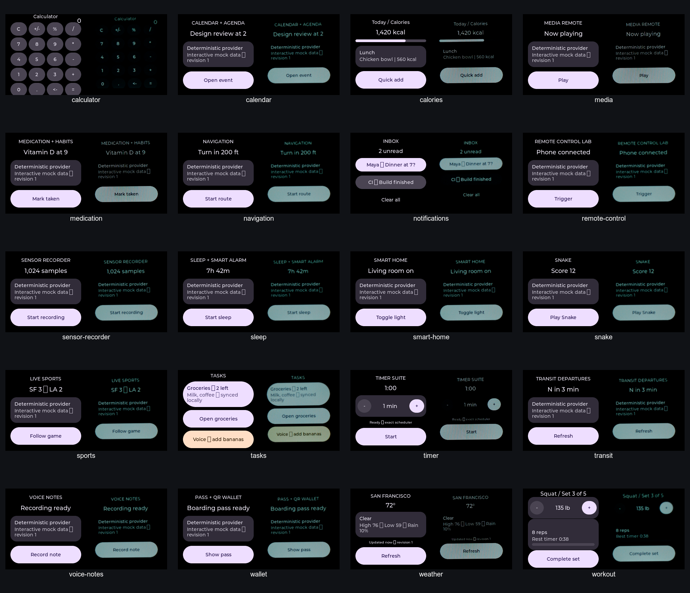

# CoreS3 SE 20-app visual conformance gate

- Date: 2026-07-30
- Board: M5Stack CoreS3 SE, ESP32-S3 revision 0.2
- Transport: USB Serial/JTAG at `/dev/cu.usbmodem21101`
- Panel: 320×240 physical, centered 240×240 watch viewport
- Camera: Logitech StreamCam, exposure 16, gain 58, automatic exposure off

## Result

**Pass: 20/20 packages rendered recognizably and consistently with the desktop
AppSpec renderer on the physical CoreS3 SE.**

Each contact-sheet cell places the deterministic 240×240 desktop render on the
left and a webcam crop of the same Rust/Wasm package running through LVGL on
the real device on the right:



The gate covers Calculator, Calendar, Calories, Media, Medication, Navigation,
Notifications, Remote Control, Sensor Recorder, Sleep, Smart Home, Snake,
Sports, Tasks, Timer, Transit, Voice Notes, Wallet, Weather, and Workout.

The hierarchy, text content, values, controls, and initial state agree in all
20 pairs. Camera color response, screen luminance, moiré, perspective, and
focus are explicitly not pixel-equality failures. A few unsupported Unicode
characters render as missing-glyph boxes in both lanes; that is shared font
coverage work rather than a hardware display-path divergence.

## What failed before this gate

The former display path combined an 80MHz panel write clock with asynchronous
`pushImageDMA`. It could report the transfer idle immediately after submission,
call `lv_display_flush_ready`, and allow LVGL to reuse a strip while M5GFX still
needed its pixels. Large updates also exposed strip corruption/reordering at
80MHz. The result ranged from missing text to visibly scrambled UI.

The corrected path:

1. runs the panel write clock at 40MHz;
2. enables RGB565 byte swapping for LVGL's host-endian `uint16_t` buffers;
3. transfers each 240×40 partial strip with blocking `pushImage`;
4. calls `lv_display_flush_ready` only after that call returns;
5. lets the normal LVGL timer coalesce mutations into one refresh; and
6. invalidates the composed screen after semantic command batches so
   transparent labels cannot clear their parent surface.

The WAMR allocator also leaves `realloc_func` null, selecting WAMR's
allocate/copy/free fallback instead of ESP-IDF's aligned `os_realloc`, which
corrupted the loader stack for several conformance guests.

## Reproduction

With the CoreS3 SE and approved webcam connected:

```bash
./scripts/capture-hardware-suite.sh --port /dev/cu.usbmodem21101
```

The script verifies each guest ABI, generates its deterministic desktop render,
builds and flashes a conformance firmware with that app visible at boot,
captures the panel with CleanCam, crops the watch viewport, and writes a
side-by-side comparison under `target/hardware-gallery/apps`.
