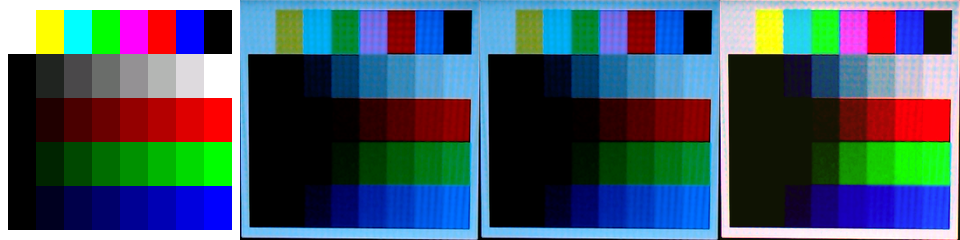

# CoreS3 SE camera color calibration

- Date: 2026-07-30
- Board: M5Stack CoreS3 SE
- Camera: Logitech StreamCam
- Capture controls: exposure 16, gain 58, white balance 4000 K, automatic
  exposure off, autofocus with a five-second settle
- Target: 240×240, 40 exact RGB565 patches

## Result

The hardware diagnostic rendered all standard bars and channel ramps in the
correct order. The white registration frame was detected automatically and
normalized to 240×240 before measurement.

The image below shows the deterministic desktop reference, uncorrected
normalized crop, the filter-stage output (identical because blur is disabled),
and fitted affine-correction preview:



The checked-in sharp UI settings produced:

- observed white: `(97, 179, 231)`;
- observed black: `(0, 0, 0)`;
- no highlight-clipped patches;
- six crushed low-code patches (`gray_1`, `red_1`, `green_1`, `blue_1`,
  `red_2`, and `green_2`);
- normalized sRGB RMSE `0.2278` before affine correction;
- normalized sRGB RMSE `0.1081` after affine correction.

The fitted v1 correction model is:

```text
expected_srgb = matrix × [observed_r, observed_g, observed_b, 1]

[ 1.97557348   0.06020243   0.04544505   0.05840726 ]
[-0.16256758   2.07645211  -0.68660427   0.07445462 ]
[ 0.03238429  -0.21867255   1.13195041   0.01136332 ]
```

All values use normalized `0..1` sRGB. This is a pragmatic capture-normalizing
matrix for this fixed screen/camera setup, not an ICC camera profile.

## Reproduction

```bash
./scripts/capture-color-bars.sh \
  --port /dev/cu.usbmodem21101 \
  --profile-output config/capture/streamcam-cores3-sharp.json
```

Once the target is displayed, settings can be swept without another flash:

```bash
./scripts/capture-color-bars.sh \
  --capture-only \
  --profile-output config/capture/streamcam-cores3-sharp.json
```

The tool saves the reference, raw capture, auto-registered crop, corrected
preview, comparison, per-patch CSV, and machine-readable calibration JSON.
App evidence uses the same profile and shares only the corrected output.
